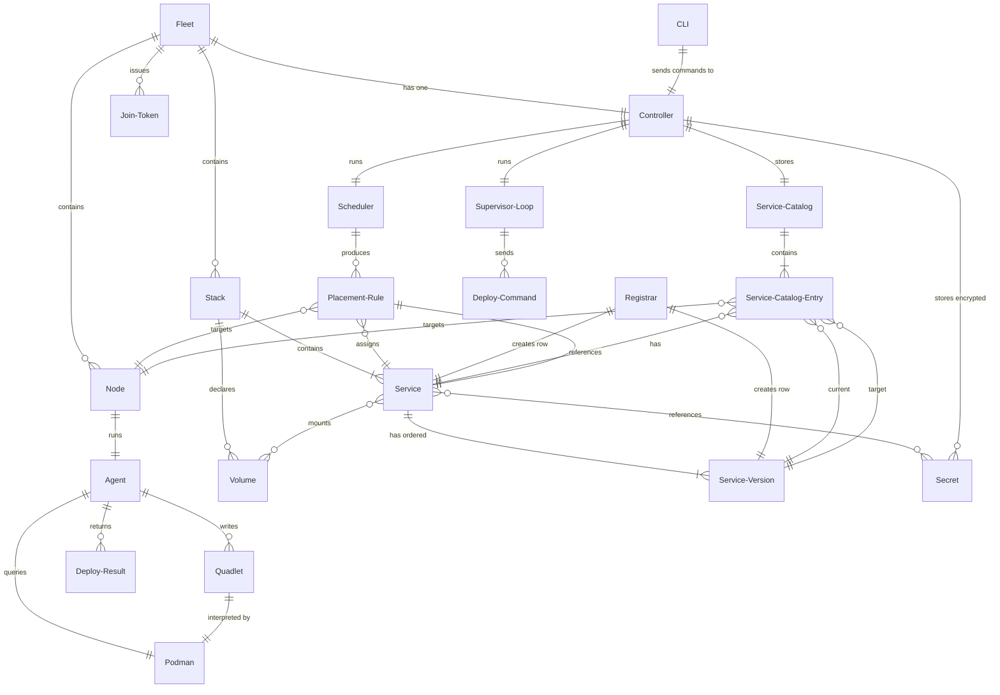

# Domain Model

Core domains and their relationships for the Podmander project.

## Glossary

### CLI (`podctl`)

The command-line interface through which operators interact with the fleet. All
commands (deploy, status, scale, rollback, secret management, etc.) are issued
through `podctl` and routed to the controller. The CLI is a lean client: it
handles command parsing, client-side liveness checks on inputs (e.g. a config
file exists and is readable), and output formatting. Authoritative parsing and
validation of service definitions happen on the controller; `podctl` relays the
controller's results rather than owning schema validation.

### Fleet

The complete set of nodes managed by a single controller. A fleet has exactly
one controller and zero or more nodes. The fleet is the unit of administration:
one join token, one state database. Fleet-level settings are configured via
`podctl` commands.

### Controller

The single node that holds all cluster state (SQLite), makes scheduling
decisions, generates configuration, and coordinates agents. It is the only
writer to the state database. Operators interact with the fleet through the
controller via `podctl`.

### Node

A machine (physical or virtual) that runs an agent and hosts services. Each
node has a unique identity, labels for scheduling constraints, and optional
capabilities (e.g., ZFS support, rootful mode). The controller node may also
run services.

### Agent

The Podmander process running on each node. Agents are stateless beyond Quadlet
files on disk. They receive configuration from the controller, write it to the
local filesystem, manage systemd units, query Podman for container state, and
report status back over ZeroMQ. On restart, an agent rediscovers its workloads
from the filesystem and Podman API.

The Agent is the protocol-layer executor the controller reaches a Node
*through*; it is not itself the unit of placement. Scheduling targets the Node;
the controller resolves a Node to its Agent only to deliver deploys and collect
results.
_Avoid_: using "Agent" as the scheduling or placement target — placement
targets a Node.

### Stack

A group of related services and volumes, initially defined in a TOML file
(analogous to a Docker Compose file). A stack always contains at least one
service. Multiple stacks can coexist in a fleet. Once deployed, the stack's
definition is stored in the controller's database; the TOML file is not
referenced again unless the operator re-deploys.

### Service

A workload. A service specifies an image, placement rules, resource limits,
health checks, and dependencies on other services. Services are the unit of
scaling and rollback. Examples: a replicated API, a singleton database, a
daemonset-style exporter. (Stacks are deferred for MVP; a Service Version can
exist without a Stack reference.)

### Abstract Service Definition (ASD)

The structured representation of a service's configuration — image, environment
variables, ports, volumes, and other parameters — independent of any specific
execution format. The ASD is what the TOML parser produces and what the quadlet
generator consumes. It is the source of truth for what a service *is*; the
quadlet is a derived artifact rendered from it on demand.
_Avoid_: Service definition (ambiguous — could mean the ASD or the TOML input)

### Service Version

An immutable snapshot of a service's ASD at a point in time. Every `podctl
deploy` that changes a service creates a new version. The controller retains N
versions per service (default 10). Rollback creates a new version with content
from a previous version (like `git revert`), so version numbers always increase.
Service Catalog entries reference a specific Service Version as their target
and current version.

### Service Catalog

The single source of truth for deployment intent and status. Each entry maps a
service to a node with a current version, target version, and failure flag.
Replaces separate desired-state and actual-state tables.
_Avoid_: State table, deployment table

### Service Catalog Entry

A row in the Service Catalog: (service, node, current_version, target_version,
failed). current_version = 0 means "not deployed." node_id = NULL means "not
yet scheduled."
_Avoid_: Catalog row, state entry

### catalog_id

An opaque correlation token identifying a Service Catalog entry. Carried in
Deployment_Command and echoed in Deployment_Result so the controller can correlate
results without relying on (service_name, node_id) lookups.
_Avoid_: Deployment ID, request ID

### Registrar

Pipeline object that creates a Service row (if new) and a Service Version row
from a parsed ASD.
_Avoid_: Inserter, persister

### Quadlet

A systemd unit file in Podman's Quadlet format (`.container`, `.volume`,
`.network`). Podmander generates Quadlets; systemd and Podman execute them.
Quadlets are the boundary between what Podmander controls and what the OS runs.

### Podman

The container runtime used to execute workloads. Agents interact with Podman
through its CLI and API to pull images, query container state, and manage
secrets. Podmander does not call Podman directly for container lifecycle —
instead it generates Quadlet files that systemd and Podman interpret. Podman
runs rootless by default under a dedicated unprivileged user.

### Placement Rule

A constraint in desired state that determines which nodes a service can run on.
Placement rules include `replicas` (N instances distributed across nodes),
`singleton` (exactly one), and `all` (one per node, daemonset-style). Rules
can reference node labels (e.g., "dedicated-vcpu"). Placement rules are part
of desired state, not expected state.
_Avoid_: Placement (ambiguous — could mean rule or decision)

### Join Token

A string that authorizes a new node to enroll in the fleet. Format:
`PTKN-<controller-z85-pubkey>-<hex-secret>`. The token embeds the controller's
CURVE public key (for encrypted transport) and a shared secret (for enrollment
authorization). Tokens can be rotated without affecting already-enrolled nodes.

### Scheduler

The controller component that evaluates placement rules, node labels, resource
availability, and constraints to produce expected state from desired state. It
runs as part of each reconciliation cycle and whenever the operator deploys or
scales a service. When conditions change (node labels, availability), the
scheduler re-runs and updates expected state.

### Scheduling Strategy

The pluggable selection rule the Scheduler uses to choose a target node for a
service. The Scheduler owns persisting the placement decision into the Service
Catalog; the strategy owns only the selection — given the current fleet state,
which node (if any) should run the service. MVP ships one strategy, *First
Available* (the first node with a connected agent). Envisioned future strategies
include least-loaded, fewest-services, label-matching, and random placement —
all of which select on node characteristics, not agent state.
_Avoid_: Scheduling policy — "policy" denotes the supervisor's drift response
(auto-repair vs. alert, ADR-0006); a placement choice is a "strategy".

### Deployment_Command

A message from Controller to Agent carrying a catalog_id, service name, and
Quadlet content. Instructs the agent to deploy or update a service.
_Avoid_: Deploy request, deploy message

### Deployment_Result

A message from Agent to Controller carrying a catalog_id, service name, and
success/failure status. Confirms whether a deployment landed.
_Avoid_: Deploy response, deploy result

### Message naming convention

Protocol message types follow the `<Noun>_<Noun>` pattern: the first word
names the domain concept (Registration, Status, Stack_Submission, Deployment),
the second names the message role (Request, Response, Command, Result, Query).
Reply types append `_Result` to the request type name (Stack_Submission →
Stack_Submission_Result, Deployment_Command → Deployment_Result).

### Stack Submission

An operator's request, issued through `podctl deploy`, to submit a Stack
definition (a TOML file) to the controller. The controller parses and validates
the TOML, registers the resulting Service Version(s), and schedules them. It
does **not** deploy in response — the supervisor loop performs the actual
deployment asynchronously. For MVP the submitted Stack holds exactly one service
and is not yet persisted as a Stack entity.
_Avoid_: Deploy request (collides with Deployment_Command, the controller→agent message)

### Stack_Submission

A message from CLI (`podctl`) to Controller carrying the raw Stack TOML and an
enrollment secret. The request side of a Stack Submission. The controller
authorizes the secret with the same check used for agent enrollment before
acting.
_Avoid_: Deploy request, config message

### Stack_Submission_Result

A message from Controller to CLI (`podctl`) confirming that a Stack_Submission was
accepted (parsed, validated, registered, scheduled) or reporting an error
(authorization rejected, parse failure, validation failure). It does not report
the eventual deployment outcome — that is observed through the controller's
logs. _Avoid_: Submit response, deploy ack

### Secret

A sensitive value (password, API key, certificate) stored encrypted in the
controller's SQLite database using libsodium secretbox. Secrets have their own
lifecycle, independent of service versions. They are decrypted only for delivery
to agents over the ZeroMQ channel.

### Volume

Persistent storage attached to a service. Volumes have a driver: `directory`
(simple bind mount) or `zfs` (managed dataset with snapshots). ZFS volumes can
be snapshotted on deploy and rolled back alongside service versions.

### Desired State

What the operator wants: the latest Service Version for each service, plus
placement rules and other deployment intent. For MVP, desired state collapses
into the Service Catalog's `target_version` column. The supervisor loop
compares `current_version` against `target_version` to detect drift. Placement
rules are added when the scheduler is implemented.

### Expected State

The scheduler's concrete assignment of service versions to specific nodes,
derived from desired state and current node topology. Each entry specifies
one service version on one node (e.g., "api v3 on worker-01"). Expected state
is regenerable — when conditions change (node loses a label, node goes down),
the scheduler re-runs and produces new expected state. **For MVP, expected
state collapses into the Service Catalog's `target_version` because placement
is trivial (deploy to the connected agent). Expected State becomes a separate
layer when the scheduler is implemented.**

### Actual State

What is actually running on each node, as reported by agents. For MVP, actual
state is the Service Catalog's `current_version` column — `0` means "not
deployed." Runtime status (RUNNING, STOPPED, DEPLOY_FAILED, etc.) is added when
agents report service-level status. The supervisor loop compares
`current_version` against `target_version` (MVP) or against expected state
(full model) to detect drift.

### Supervisor Loop

The controller's continuous reconciliation cycle: receive Deploy_Results,
update Service Catalog entries, compare `current_version` against
`target_version`, and act on divergences (deploy or alert). There is no
separate "recovery mode" — startup, steady state, and failure recovery all use
the same loop.

### Infrastructure Component

A cluster-wide service managed by Podmander but not defined as a user service.
Infrastructure components include:

- **Caddy** — ingress proxy, configured via generated Caddyfile
- **CoreDNS** — service discovery, configured via generated zone files
- **Restic** — backups, configured via generated config and systemd timers

Infrastructure components have their own versioning (like services) and are
subject to drift detection. When the agent detects that a config file hash
doesn't match the expected value, the controller auto-repairs by redeploying
the expected config.

### Infra Version

An immutable snapshot of an infrastructure component's configuration at a point
in time. Like service versions, infra versions use monotonic numbering and
revert-style rollback. Each version stores the config content and its hash for
drift detection.

## Relationships

- A **Service** has zero or more **Service Versions** (1:N)
- A **Service** has zero or more **Service Catalog Entries** (1:N, one per node)
- A **Service Catalog Entry** references one **Service Version** as its target (N:1)
- A **Service Catalog Entry** references one **Service Version** as its current version (N:1, or 0 = not deployed)
- A **Service Catalog Entry** references one **Node** (N:1, or NULL = not scheduled)
- The **Registrar** consumes an ASD and produces a **Service** row and a **Service Version** row
- The **Scheduler** consumes a **Service Version** and produces or updates a **Service Catalog Entry**
- The **Scheduler** delegates target selection to a **Scheduling Strategy**
- The **Supervisor** reads **Service Catalog Entries** and produces **Deploy_Commands**
- An **Agent** receives a **Deploy_Command** and produces a **Deploy_Result**
- The Controller processes a **Deploy_Result** and updates a **Service Catalog Entry**

## Example dialogue

> **Dev:** "When the operator deploys a new TOML, what happens?"
> **Domain expert:** "The Parser produces an ASD. The Registrar creates a Service Version. The Scheduler creates a Service Catalog Entry with current_version = 0 and target_version = the new version. On the next Supervisor iteration, it sees the mismatch and sends a Deploy_Command."
>
> **Dev:** "What if no agent is connected yet?"
> **Domain expert:** "The Scheduler creates the catalog entry with node_id = NULL. The Supervisor skips it until an agent registers, then calls the Scheduler again to assign the node."
>
> **Dev:** "What if a deploy fails?"
> **Domain expert:** "The Deploy_Result handler sets the failed flag on the catalog entry. The Supervisor won't retry until the operator deploys a new version, which resets the flag."

## Flagged ambiguities

- "Desired state" and "expected state" were used interchangeably in early discussions. Resolved: for MVP, both collapse into the Service Catalog's target_version. The full three-state model (ADR-0005) is deferred until the scheduler is implemented.
- "Actual state" was a separate table. Resolved: replaced by Service Catalog's current_version column. The catalog is the single source of truth for both intent and reality.
- "Service definition" was ambiguous between the parser output type and the domain concept. Resolved: the parser type is Service_Definition; the domain concept is Abstract Service Definition (ASD).
- "Node" and "Agent" were used interchangeably, and the code conflated them: the Service Catalog stored an `Agent_Id`, while the agent's ZeroMQ routing identity was misnamed `node_id`. Resolved: a **Node** is the durable domain object that placement targets and that carries scheduling-relevant characteristics (labels, capabilities); an **Agent** is the protocol-layer process running on a Node that executes deploys and reports status. A Node is associated 1:1 with an Agent and reached through that Agent's connection identity (renamed `Connection_Id`; formerly mis-called `node_id`). The Service Catalog references a **Node**. Aligning the code with this model — a first-class Node entity, the `Agent_Id`→`Node_Id` catalog change, and the `Connection_Id` rename — is tracked in a separate issue.
