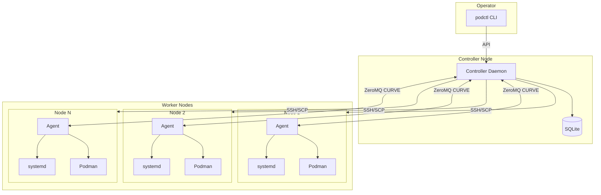
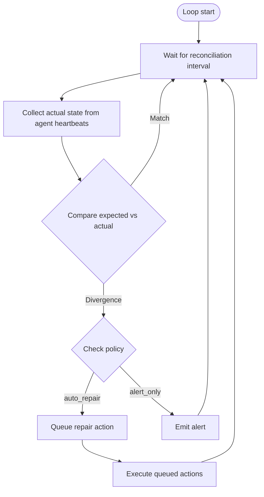
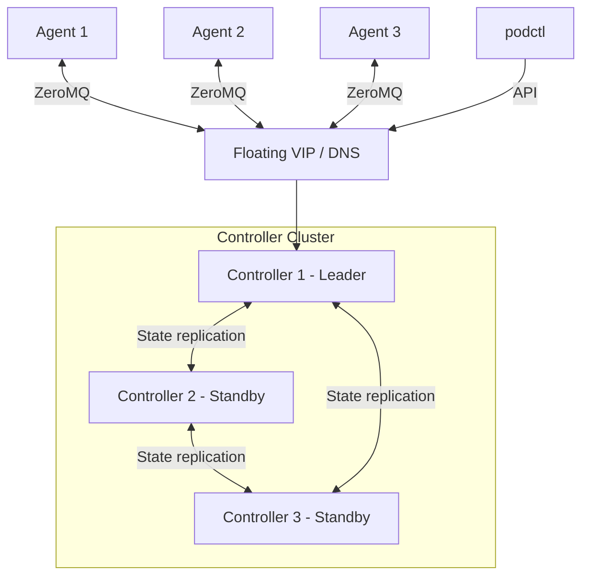
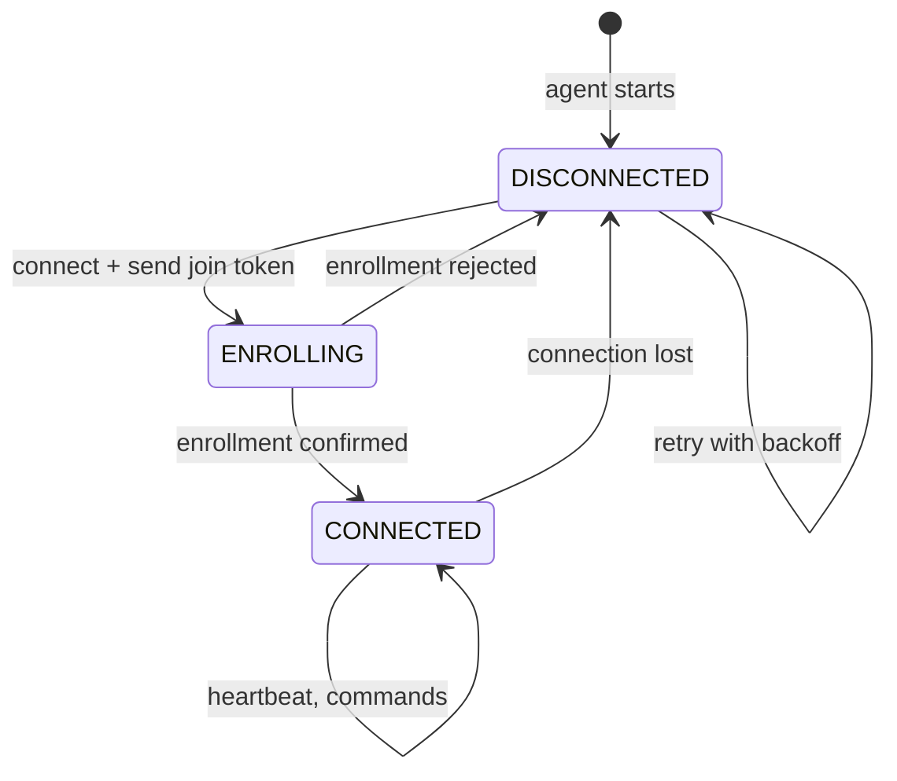
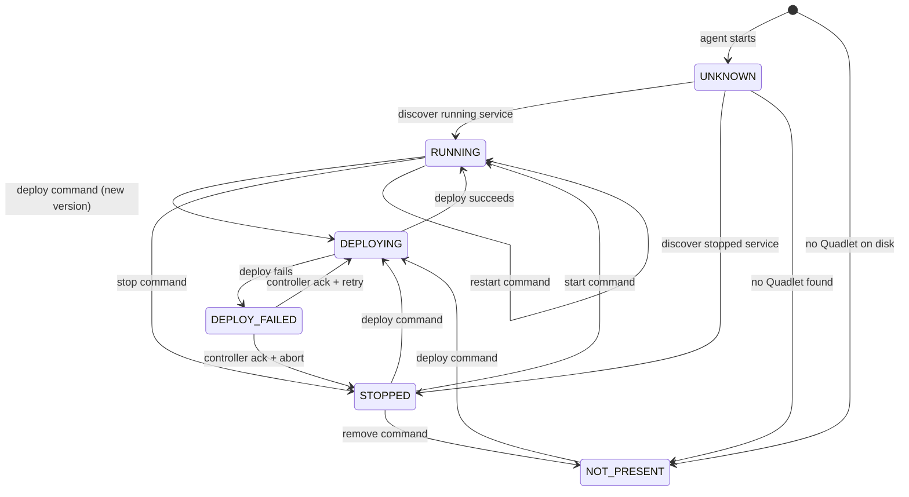
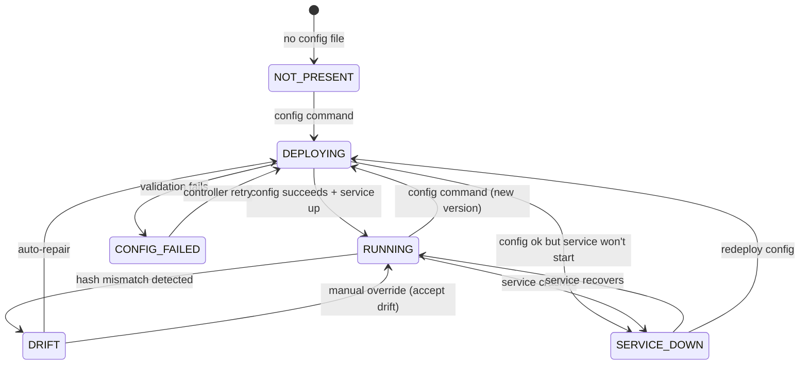

# Architecture Specification

Container orchestration system for small multi-node deployments. Generates
configuration for specialized tools rather than reimplementing their
functionality.

For architectural decisions and rationale, see:
- [ADR-0001](../adr/0001-controller-agent-topology.md) — Controller-agent topology
- [ADR-0005](../adr/0005-three-state-model.md) — Three-state model
- [ADR-0006](../adr/0006-continuous-supervisor-loop.md) — Supervisor loop
- [ADR-0007](../adr/0007-services-as-systemd-units.md) — Services as systemd units
- [ADR-0008](../adr/0008-one-operation-per-service.md) — One operation per service

## System Topology



## Core Pattern

The orchestrator generates configuration; other tools execute:

| Generated config | Executing tool |
|------------------|----------------|
| Quadlet files | systemd + Podman |
| Restic config + timers | systemd + Restic |
| Caddyfile | Caddy |
| CoreDNS zone files | CoreDNS |

## Controller

Long-running daemon on a designated node. Responsibilities:

- API endpoint for CLI commands
- Scheduler: decide service placement based on constraints and node capacity
- Supervisor loop: continuously compare expected vs actual state, repair drift
- Secret storage: encrypted at rest, decrypted for delivery to agents
- Config generation: produce Quadlets, Caddyfiles, zone files from TOML definitions

SQLite stores:
- Desired state (user declarations from TOML)
- Expected state (what should be deployed where)
- Actual state (last reported by agents)
- Secrets (encrypted with libsodium secretbox)
- Node metadata, labels, and capabilities
- Version history for services and infrastructure configs

### Supervisor Loop



There is no separate "recovery mode." Startup, steady state, and failure recovery
all use the same loop. A configurable grace period prevents false alerts during
cluster boot.

### Controller High Availability (Future)

Multiple controller instances share a CURVE keypair. State replication ensures
all instances have consistent data. Only one instance (leader) accepts commands
at a time. Agents connect to a floating VIP or DNS name; on failover, they
reconnect to the new leader without re-enrollment.



Single-controller mode is the initial implementation. The specific consensus
protocol for leader election and state replication will be determined during the
HA design phase.

## Agents

Long-running daemon on each worker node. Responsibilities:

- Maintain ZeroMQ connection to controller
- Report node status via periodic heartbeat
- Execute deploy/stop/restart commands for services
- Execute config updates for infrastructure components (Caddy, CoreDNS)
- Query Podman and systemd for actual state
- Verify file integrity after SSH transfers

Agents are stateless beyond Quadlet files on disk. On restart, they rediscover
existing workloads by scanning the filesystem and querying Podman.

### Agent State Machine

**Connection state:**



| State | Meaning |
|-------|---------|
| DISCONNECTED | No ZeroMQ connection to controller |
| ENROLLING | Connected, join token sent, awaiting confirmation |
| CONNECTED | Enrolled and operational |

**Service state (per service):**



| State | Meaning |
|-------|---------|
| UNKNOWN | Agent just started, hasn't queried this service yet |
| RUNNING | Systemd unit active, container running |
| STOPPED | Systemd unit exists but inactive |
| DEPLOYING | Deploy in progress |
| DEPLOY_FAILED | Last deploy failed, awaiting controller ack |
| NOT_PRESENT | No Quadlet file for this service |

**Infrastructure component state (per component):**



| State | Meaning |
|-------|---------|
| RUNNING | Config deployed, service running, hash matches |
| DRIFT | Service running, config hash doesn't match expected |
| CONFIG_FAILED | Last config deploy failed validation |
| SERVICE_DOWN | Config correct but service not running |

## Managed Resources

### Application Services

Deployed as Quadlet files. Per-node placement with replication support.

```
[service.api]
image = "myapp:v2.1"
replicas = 2
```

### Infrastructure Components

| Component | Config file | Location | Reload |
|-----------|-------------|----------|--------|
| Caddy | Caddyfile | Ingress node(s) | `caddy reload` |
| CoreDNS | Zone files | DNS node(s) | Auto-reload on file change |
| Restic | Config + timers | Backup node(s) | `systemctl daemon-reload` |

Infrastructure configs use the same versioning model as services
([ADR-0024](../adr/0024-infrastructure-component-versioning.md)).

### Drift Detection and Auto-Repair

On each heartbeat, agents report config hashes for infrastructure components. If
the hash doesn't match expected, the controller detects drift.

Default policy: auto-repair. The controller redeploys the expected config,
overwriting manual changes. Podmander is the source of truth.

## Privilege Model

The agent runs as root on all nodes
([ADR-0012](../adr/0012-rootless-containers-rootful-agent.md)). Two container
modes per node:

| Mode | Container User | Capabilities |
|------|----------------|--------------|
| Rootless | Unprivileged user via Podman user namespaces | Podman, user systemd, bind-mount volumes |
| Rootful | root | Above + volume snapshots, privileged ports |

Typical setup:
- Application nodes: rootless containers
- Ingress node: rootful containers (ports 80/443)
- Storage nodes: rootful containers (ZFS/BTRFS snapshots)

## Failure Scenarios

### Agent Crash

- Services keep running (systemd units)
- Controller marks agent as unresponsive after missed heartbeats
- Agent restarts, reconnects, reports status
- Supervisor loop reconciles any drift

### Controller Crash (Single Controller)

- Agents detect disconnect, enter DISCONNECTED state
- Services keep running on all nodes
- No new deploys possible until controller restarts
- Operator restarts controller; agents reconnect
- Supervisor loop reconciles

### Controller Failover (HA Mode)

- Consensus mechanism detects leader failure, elects new leader
- New leader has replicated state
- Agents reconnect to floating endpoint (same CURVE keypair)
- Supervisor loop resumes

### Node Network Partition

- Controller marks partitioned agent as disconnected
- Services on partitioned node keep running
- When connectivity restores, agent reconnects
- Supervisor loop reconciles version mismatches

## Open Items

- Upgrade path for Podmander itself (controller and agent binaries)
- Consensus protocol selection for controller HA
- Agent resource reporting (CPU, memory, disk) for scheduler decisions
- Rate limiting on auto-repair to prevent thrashing
