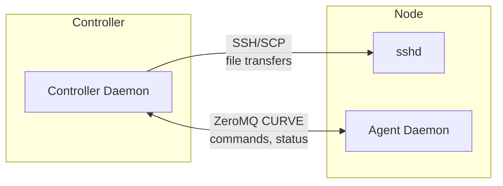
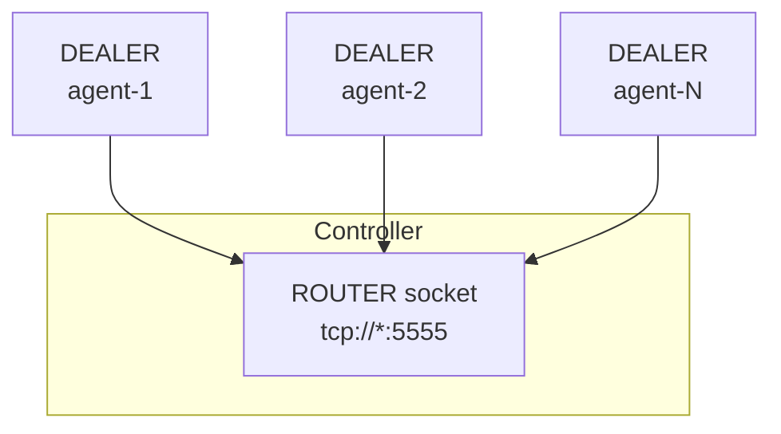
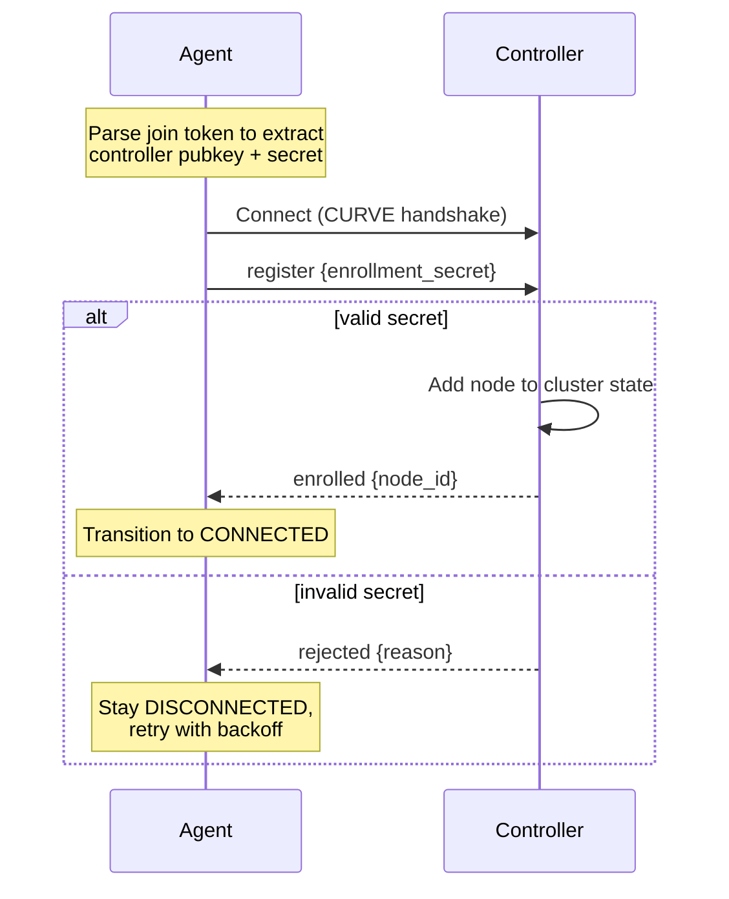
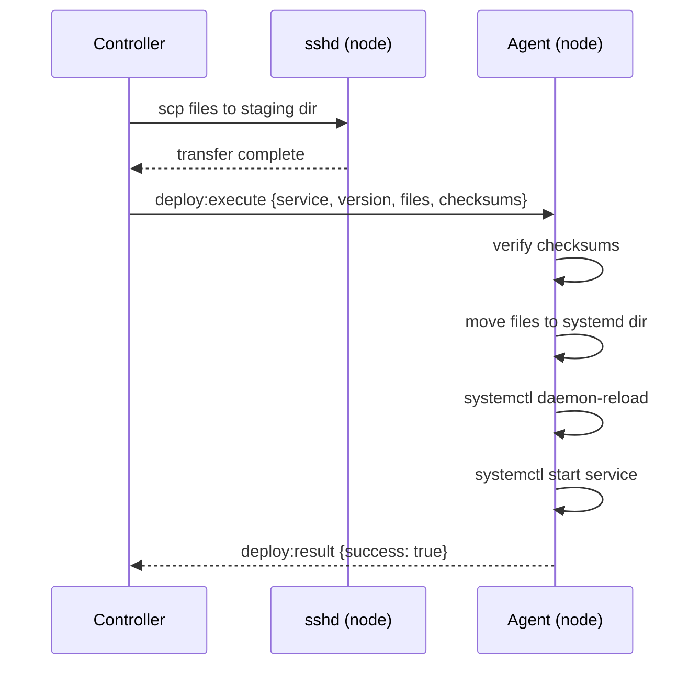
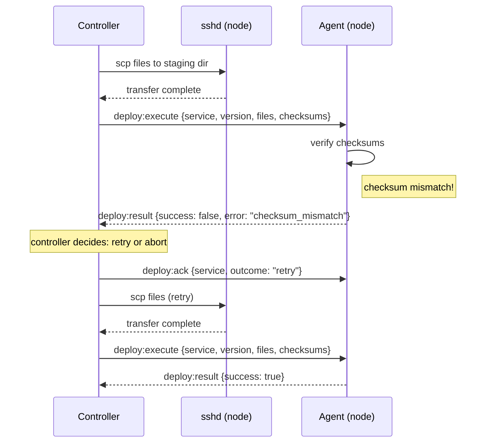

# Networking Specification

Control plane communication via ZeroMQ, data plane via SSH, and optional
node-to-node encryption via WireGuard.

For architectural decisions and rationale, see:
- [ADR-0009](../adr/0009-zeromq-curve-for-control-plane.md) — ZeroMQ with CURVE for control plane
- [ADR-0010](../adr/0010-ssh-for-data-plane.md) — SSH for data plane
- [ADR-0013](../adr/0013-wireguard-optional-node-encryption.md) — WireGuard as optional node-level encryption
- [ADR-0014](../adr/0014-wireguard-per-node-slash32-ips.md) — Per-node /32 WireGuard IPs
- [ADR-0015](../adr/0015-node-local-wireguard-keypairs.md) — Node-local WireGuard keypair generation

## Communication Architecture

| Plane | Protocol | Purpose |
|-------|----------|---------|
| Control | ZeroMQ with CURVE | Commands, status, heartbeats |
| Data | SSH/SCP | File transfers (Quadlets, configs) |



## Control Plane: ZeroMQ

### Socket Pattern

Controller binds a ROUTER socket; agents connect with DEALER sockets.



### CURVE Encryption

All ZeroMQ traffic is encrypted using CURVE (libsodium-based).

Key management:
- Controller generates a CURVE keypair on cluster initialization
- Public key is distributed via join token
- All controller instances (in HA mode) share the same keypair
- Each agent generates its own keypair on startup

Join token format:

```
PTKN-<z85-controller-pubkey>-<hex-enrollment-secret>
```

### Agent Enrollment



### Heartbeat

```toml
[agent]
heartbeat_interval = 30     # seconds between heartbeats
```

Heartbeat payload:
- Agent identity
- Uptime
- Per-service status (name, version, state)
- Per-infrastructure-component status (name, version, hash, state)

Controller timeout:
- 2x interval with no heartbeat: mark agent `unresponsive`
- 3 consecutive heartbeats missed: mark agent `disconnected`

### Controller Endpoint

```toml
[controller]
bind = "tcp://0.0.0.0:5555"      # controller listens here
```

```toml
[agent]
controller = "tcp://controller.internal:5555"
```

For HA, this endpoint should be a floating VIP or DNS name that follows the
leader.

### Message Types

**Controller → Agent:**

| Message | Payload | Purpose |
|---------|---------|---------|
| `deploy:execute` | service, version, files[], checksums{} | Deploy a service version |
| `config:execute` | component, version, file, checksum, target, reload_cmd | Deploy infrastructure config |
| `stop:execute` | service | Stop a service |
| `restart:execute` | service | Restart a service |
| `status:request` | (optional filter) | Request current state |
| `deploy:ack` | service, outcome | Acknowledge DEPLOY_FAILED state |

**Agent → Controller:**

| Message | Payload | Purpose |
|---------|---------|---------|
| `heartbeat` | agent_id, uptime, services[], infra[] | Periodic status |
| `deploy:result` | service, version, success, error? | Deploy outcome |
| `config:result` | component, version, success, error? | Config deploy outcome |
| `status:response` | services[], infra[], containers[] | Current state |

## Data Plane: SSH

### Purpose

SSH transfers files from controller to agent nodes:
- Quadlet files (`.container`, `.volume`, `.network`)
- Caddyfile
- CoreDNS zone files
- Restic configuration

### Node Configuration

```toml
[node.web-1]
host = "web-1.example.com"      # or IP address
ssh_user = "podmander"          # SSH user for file transfers
ssh_port = 22                   # optional, defaults to 22
mode = "rootless"               # or "rootful"

[node.storage-1]
host = "192.168.1.10"
ssh_user = "root"
mode = "rootful"                # required for ZFS operations
```

### Staging Directory

Files are transferred to a staging directory before the agent acts on them:

```toml
[agent]
staging_dir = "/tmp/podmander-stage"    # default
```

Flow:
1. Controller SCPs files to `staging_dir`
2. Controller sends `deploy:execute` via ZeroMQ with checksums
3. Agent verifies checksums in staging
4. Agent moves files to target directory
5. Agent reloads service

### Connection Multiplexing

```toml
[ssh]
control_persist = 60        # seconds to keep idle connections open
max_connections = 10        # max parallel connections per node
control_path = "~/.local/share/podmander/ssh/%r@%h:%p"
```

### Deploy Sequence



### Failure Handling



### Bastion/Jump Host Support

```toml
[node.internal-1]
host = "10.0.0.5"
ssh_user = "podmander"
ssh_proxy = "bastion.example.com"   # SSH ProxyJump
```

## Node-to-Node Encryption (Optional)

For deployments where nodes communicate over untrusted networks, Podmander
generates WireGuard configurations to encrypt all inter-node traffic. This is a
node-level transport layer, not a container overlay network.

### WireGuard Mesh

Architecture:
- Each node runs WireGuard as a systemd service (`wg-quick@wg0`)
- Full mesh topology: every node peers with every other node
- Controller generates peer configurations; agent applies them locally

Address allocation:
- Each node receives a single WireGuard IP from the cluster pool (default:
  `10.99.0.0/16`)
- Example: Node A: `10.99.0.1/32`, Node B: `10.99.0.2/32`
- When WireGuard is enabled, CoreDNS resolves service names to WireGuard IPs

Key management:
- Each node generates its own WireGuard keypair locally; private keys never leave
  the node
- Public keys are exchanged via the CURVE-encrypted ZeroMQ channel
- The controller distributes peer public keys and endpoints to all nodes

### Networking Setup Flow

1. Node enrolls via join token (ZeroMQ CURVE) — WireGuard is not involved
2. After enrollment, the agent checks WireGuard availability; if enabled but not
   installed, the networking step fails with a clear error
3. Agent generates a WireGuard keypair and sends the public key to the controller
4. Controller allocates a WireGuard IP and sends back peer configurations
5. Agent writes `/etc/wireguard/wg0.conf` (mode `0600`, root-owned) and starts
   `wg-quick@wg0`
6. Controller pushes updated peer configs to all existing nodes

Config updates (node add/remove) use `wg syncconf` to avoid dropping existing
connections.

### Separate Endpoint Address

```toml
[node.web-1]
host = "10.0.0.5"                # private IP for SSH
wg_endpoint = "203.0.113.10"     # public IP for WireGuard
```

### MTU and NAT

- Default WireGuard MTU: 1420 (configurable)
- `PersistentKeepalive` default: 25 seconds (configurable) for peers behind NAT
- NAT-to-NAT (both peers behind NAT) is not supported — use Tailscale for these
  environments

### Scale Limits

Full mesh works well up to ~20 nodes:

| Nodes | Peers/node | Config churn on join/leave |
|-------|------------|---------------------------|
| 10    | 9          | 9 peer updates            |
| 20    | 19         | 19 peer updates           |
| 50    | 49         | 49 peer updates (painful) |

Beyond ~20 nodes, hub-and-spoke topology is a future extension.

### Performance Considerations

WireGuard uses ChaCha20-Poly1305 for encryption. Realistic single-tunnel
throughput on modern x86: 1–10 Gbps. The bottleneck is typically single-thread
per tunnel (one core per peer).

Where throughput may be a concern:
- Backup traffic between storage nodes
- Large dataset workloads (analytics, ML, video)
- Low-power nodes without AVX2

Mitigations: bypass WireGuard for specific flows, use private connectivity,
stay current with kernel versions.

## Required Ports

| Port | Protocol | Direction | Purpose |
|------|----------|-----------|---------|
| 5555 (configurable) | TCP | Agent → Controller | ZeroMQ control plane |
| 22 (configurable) | TCP | Controller → Node | SSH file transfers |
| 51820 (configurable) | UDP | Node ↔ Node | WireGuard mesh |
| 53 | UDP/TCP | Containers → DNS node | Service discovery |
| 80, 443 | TCP | External → Ingress | HTTP/HTTPS traffic |

## Security Considerations

### Control Plane Security

- All ZeroMQ traffic encrypted with CURVE (NaCl/libsodium)
- Enrollment requires knowledge of join token (shared secret)
- Join tokens can be rotated without affecting enrolled nodes

### Data Plane Security

- SSH with key-based authentication only
- Controller's SSH key should be dedicated to Podmander
- Consider `command=` restrictions in `authorized_keys` for defense in depth

### Network Segmentation

Recommended:
- Control plane (ZeroMQ) on management network
- Container traffic on application network
- SSH access from controller only

## Open Items

- Agent-side firewall configuration tooling
- Mutual TLS as future alternative to CURVE (for standard PKI integration)
- Behavior when ControlMaster socket is stale (detection, cleanup)
- WireGuard: connectivity monitoring and alerting for tunnel health
- WireGuard: key rotation procedure (operator-initiated)
