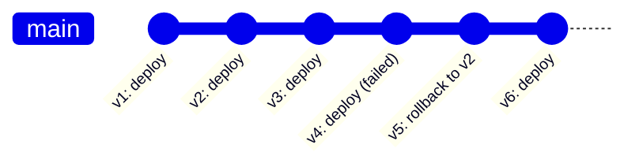
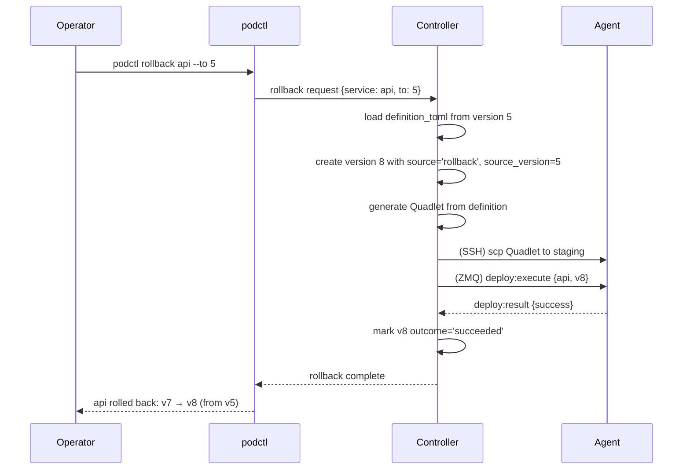
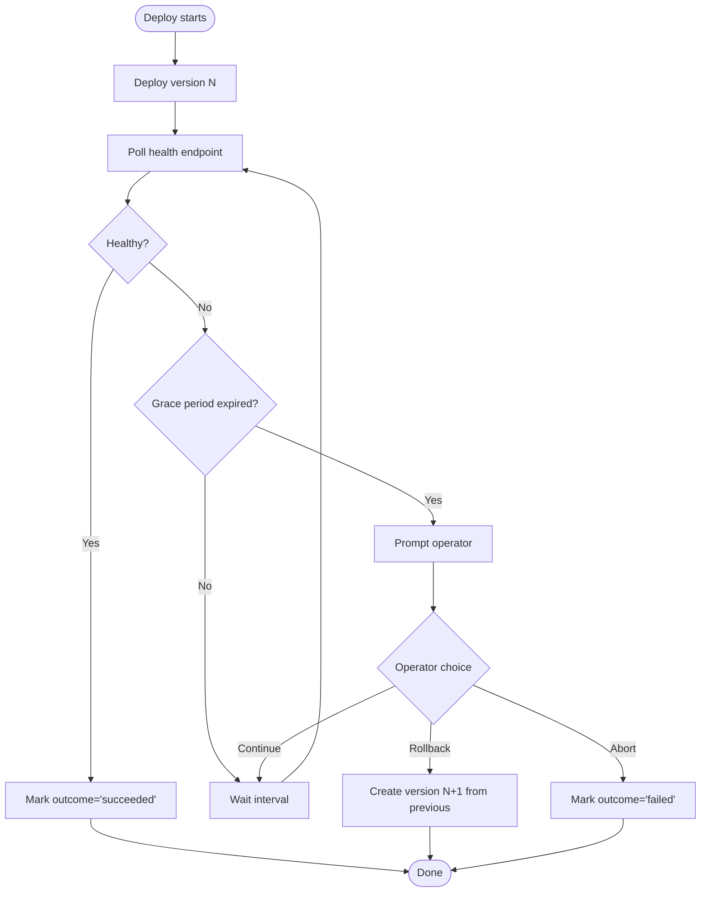

# Rollback Specification

Service versioning, rollback mechanism, and deploy-time health verification.

For architectural decisions and rationale, see:
- [ADR-0023](../adr/0023-per-service-monotonic-versioning.md) — Per-service monotonic versioning
- [ADR-0024](../adr/0024-infrastructure-component-versioning.md) — Infrastructure component versioning

## Versioning Model



Version numbers always increase. Rollback creates a new version from a previous
version's content — the history is linear and auditable.

## Versioning Scope

### Versioned Per Service

- Image reference
- Environment variables
- Resource limits
- Port mappings
- Volume mounts
- Health check configuration
- Placement constraints

### Versioned Per Infrastructure Component

- Caddyfile content
- CoreDNS zone file content
- Restic configuration

### Not Versioned

- Current placement decisions (operational, not declarative)
- Secrets (separate lifecycle via `podctl secret` commands)

## Storage Schema

```sql
CREATE TABLE service_versions (
    service_name TEXT NOT NULL,
    version INTEGER NOT NULL,
    definition_toml TEXT NOT NULL,
    source TEXT NOT NULL,           -- 'deploy', 'rollback', 'repair'
    source_version INTEGER,         -- if rollback, which version was the source
    created_at TEXT NOT NULL,
    deployed_at TEXT,
    outcome TEXT,                   -- 'succeeded', 'failed', NULL (pending)
    failure_reason TEXT,
    PRIMARY KEY (service_name, version)
);

CREATE TABLE infra_versions (
    component TEXT NOT NULL,        -- 'caddy', 'coredns', 'restic'
    node_name TEXT NOT NULL,
    version INTEGER NOT NULL,
    config_hash TEXT NOT NULL,
    config_content TEXT NOT NULL,
    source TEXT NOT NULL,
    source_version INTEGER,
    created_at TEXT NOT NULL,
    deployed_at TEXT,
    outcome TEXT,
    failure_reason TEXT,
    PRIMARY KEY (component, node_name, version)
);

CREATE TABLE deployment_log (
    id INTEGER PRIMARY KEY,
    resource_type TEXT NOT NULL,    -- 'service' or 'infra'
    resource_name TEXT NOT NULL,
    node_name TEXT NOT NULL,
    from_version INTEGER,
    to_version INTEGER NOT NULL,
    started_at TEXT NOT NULL,
    completed_at TEXT,
    outcome TEXT,                   -- 'succeeded', 'failed', 'rolled_back'
    failure_reason TEXT
);
```

Default retention: 10 versions per service (configurable).

## Rollback Flow



## CLI Commands

```bash
podctl rollback api                    # Previous successful version
podctl rollback api --to 5             # Specific version
podctl rollback --all --before "1h"    # Cluster state as of 1 hour ago
podctl history api                     # Show versions
```

## History Output

```
VERSION  SOURCE          OUTCOME    DEPLOYED             IMAGE
8        rollback (v5)   succeeded  2024-01-15 15:00:00  myapp:v2.0
7        deploy          failed     2024-01-15 14:30:00  myapp:v2.1-broken
6        deploy          succeeded  2024-01-14 09:00:00  myapp:v2.1
5        deploy          succeeded  2024-01-10 11:20:00  myapp:v2.0
4        rollback (v2)   succeeded  2024-01-08 16:00:00  myapp:v1.8
3        deploy          failed     2024-01-08 15:30:00  myapp:v1.9-broken
2        deploy          succeeded  2024-01-05 08:00:00  myapp:v1.8
1        deploy          succeeded  2024-01-01 10:00:00  myapp:v1.7
```

## Deploy-Time Health Verification

```toml
[service.api.health]
endpoint = "/health"
interval = "10s"
timeout = "5s"
retries = 3

[service.api.deploy]
wait_healthy = true     # Wait for health checks after deploy
grace_period = "120s"   # Max time to wait for healthy status
```



## Edge Cases

| Situation | Behavior |
|-----------|----------|
| First deploy | No rollback target. `podctl rollback` errors. Operator recourse: `podctl stop` or fix forward. |
| Rollback during in-progress deploy | Queue the rollback. Complete or abort current deploy first. |
| Mixed versions during rollback | Supervisor loop reconciles naturally. Brief mixed-version window is acceptable. |
| Volume schema migrations | Warning issued — rollback will not reverse database changes. |
| Rollback target was a failure | Allowed with warning — failure may have been environmental. |

## Infrastructure Component Rollback

Same model as services:

```bash
podctl rollback caddy --to 5           # Rollback Caddyfile to version 5
podctl history caddy                   # Show Caddyfile versions
```
