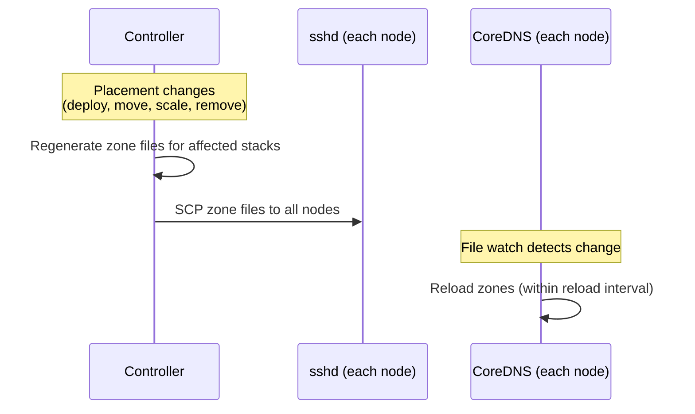

# Service Discovery Specification

DNS-based service discovery using CoreDNS, with environment variable injection
for port communication.

For architectural decisions and rationale, see:
- [ADR-0016](../adr/0016-coredns-daemonset.md) — CoreDNS daemonset
- [ADR-0017](../adr/0017-hybrid-port-model.md) — Hybrid port model
- [ADR-0018](../adr/0018-dns-hosts-envvars-ports.md) — DNS for hosts, env vars for ports
- [ADR-0019](../adr/0019-per-stack-dns-zones.md) — Per-stack DNS zones

## Port Allocation

### Explicit Port

A hard scheduling constraint. The scheduler must place on nodes where the port
is available.

```toml
[service.postgres]
image = "postgres:16"
port = 5432              # hard constraint: must be this port
```

### Auto-Detected Port

Podmander reads the container port from the image's `EXPOSE` directive. The
scheduler tries the natural port first; if unavailable, auto-assigns from the
managed range (default: 30000–32767, configurable).

```toml
[service.postgres]
image = "postgres:16"    # EXPOSE 5432 in image → tries port 5432
```

### No Port

Services with no declared port and no `EXPOSE` deploy without port allocation
or discovery. Valid for batch jobs and cron tasks.

### Multiple Named Ports

```toml
[service.gateway]
image = "mygateway:latest"
ports = { http = 8080, grpc = 9090 }
```

### Port Stability

Once assigned, a port stays stable across service moves. It only changes when
forced (the only available node already uses that port).

### Replica Port Consistency

All replicas of a service use the same port. If scaling requires a port change,
all replicas are reassigned to the same auto-assigned port.

## DNS Resolution

### Zone Structure

Each stack gets a zone: `<stack>.podmander.internal`.

```
; Zone: webapp.podmander.internal
api     IN A    10.99.0.1       ; node running api
api     IN A    10.99.0.2       ; second replica of api
postgres IN A   10.99.0.3       ; node running postgres
redis    IN A   10.99.0.1       ; node running redis
```

When WireGuard is enabled, A records resolve to WireGuard IPs. When disabled,
they resolve to host IPs.

### Corefile

```
<stack>.podmander.internal {
    file /etc/podmander/zones/<stack>.zone
    reload 5s
    log
}

. {
    forward . /etc/resolv.conf
    cache 30
}
```

### DNS Search Domain

Containers in a stack get their stack's zone as the search domain. A container
in the `webapp` stack can query `postgres` and it resolves to
`postgres.webapp.podmander.internal`.

### Replicated Services

One A record per node running a replica. Standard DNS round-robin distributes
queries across replicas.

### TTL

Default: 5 seconds (configurable):

```toml
[dns]
ttl = 5                     # seconds
```

### Stack Isolation

Each stack has its own zone. Cross-stack resolution is possible via FQDN
(`postgres.other-stack.podmander.internal`) but no env vars are injected
across stack boundaries.

## Environment Variable Injection

### Dependency Declaration

```toml
[service.api]
image = "myapp:latest"
depends_on = ["postgres", "redis"]
```

### Injected Variables

For each dependency:

| Variable | Value | Example |
|----------|-------|---------|
| `<SERVICE>_HOST` | DNS name (not resolved IP) | `postgres.webapp.podmander.internal` |
| `<SERVICE>_PORT` | Allocated host port | `5432` |

For multi-port services:

| Variable | Value | Example |
|----------|-------|---------|
| `<SERVICE>_<NAME>_HOST` | DNS name | `gateway.webapp.podmander.internal` |
| `<SERVICE>_<NAME>_PORT` | Named port | `8080` |

### Naming Convention

Service names are uppercased with hyphens replaced by underscores:

| Service name | Env var prefix |
|-------------|----------------|
| `postgres` | `POSTGRES_` |
| `my-api` | `MY_API_` |
| `redis` | `REDIS_` |

### When Restarts Occur

- **Host changes** (service moves): NO restart — `_HOST` contains a DNS name.
- **Port changes** (rare): Quadlet files regenerated, dependent containers
  restarted.

### Scope

Environment variable injection is stack-scoped. `depends_on` can only reference
services within the same stack.

## Container DNS Configuration

Each stack gets a Podman network with the local CoreDNS instance as DNS server:

```
podman network create podmander-<stack> \
  --dns <coredns-ip> \
  --opt com.docker.network.bridge.name=pm-<stack>
```

External DNS resolution falls through to the system resolver.

## Zone File Lifecycle



Zone files are regenerated whenever placements change:
- Service deployed, moved, scaled, or removed
- Node added or removed from the fleet
- Port reassignment (rare)

## Open Items

- Health-aware DNS (return only healthy replicas)
- Hard cross-stack isolation via namespace-scoped DNS filtering
- CoreDNS metrics integration with monitoring
- Interaction between `depends_on` and service startup ordering
- Virtual IPs per service for true port-conflict elimination
