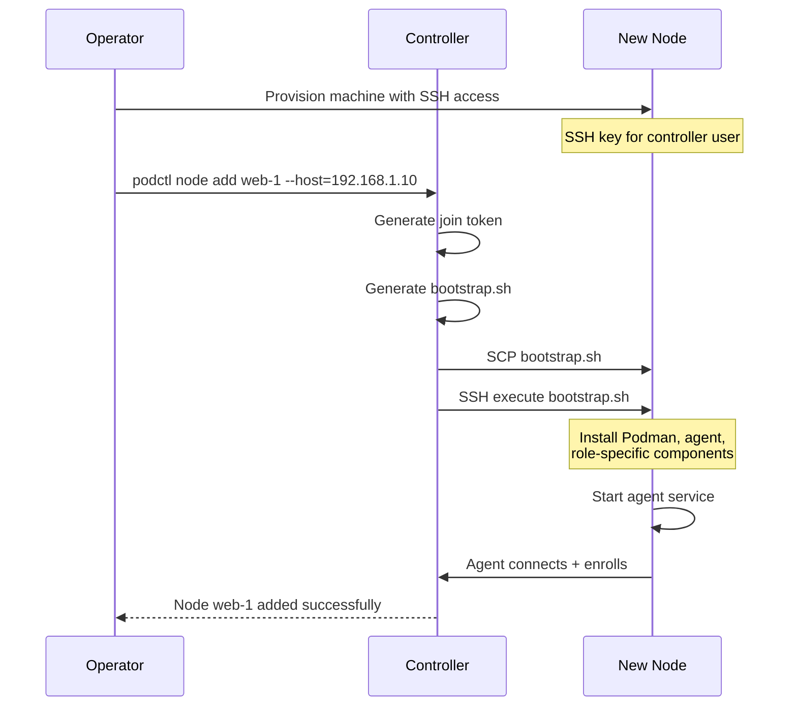

# Setup Specification

Initial setup of controllers and nodes.

For architectural decisions and rationale, see:
- [ADR-0032](../adr/0032-ssh-based-node-bootstrap.md) — SSH-based node bootstrap with role-based installation

## Overview

Podmander requires minimal prerequisites on target machines. The controller
bootstraps nodes by transferring and executing a setup script over SSH.



## Prerequisites

### Controller Machine

| Requirement | Notes |
|-------------|-------|
| SSH client | OpenSSH for node communication |
| SSH keypair | Will be deployed to nodes for ongoing access |
| Network access | Reachable by nodes on ZeroMQ port (default 5555) |

### Node Machines

| Requirement | Notes |
|-------------|-------|
| SSH server | OpenSSH or compatible, key-based auth |
| Controller's SSH pubkey | In `authorized_keys` for the bootstrap user |
| Root or sudo access | For bootstrap; agent also runs as root |
| Network access | Can reach controller on ZeroMQ port |
| Systemd | For service management |
| Package manager | apt, dnf, or pacman |
| WireGuard (optional) | Required only if node-to-node encryption is enabled |

## Controller Setup

### Initialize a New Fleet

```bash
podctl init
```

Creates:
- SQLite database at `~/.local/share/podmander/state.db`
- CURVE keypair at `~/.local/share/podmander/keys/`
- Default configuration at `~/.config/podmander/config.toml`

### Start the Controller

```bash
podctl controller start
```

Or install as a systemd service:

```bash
podctl controller install
systemctl --user enable --now podmander-controller
```

### Controller Configuration

```toml
# ~/.config/podmander/config.toml

[controller]
bind = "tcp://0.0.0.0:5555"          # ZeroMQ listen address
data_dir = "~/.local/share/podmander"

[ssh]
key = "~/.ssh/podmander_ed25519"     # SSH key for node access
control_persist = 60                  # ControlMaster timeout
```

## Node Setup

### Add a Node

```bash
podctl node add <name> --host=<address> [--ssh-user=<user>] [--role=<role>]
```

| Parameter | Default | Description |
|-----------|---------|-------------|
| `--host` | required | IP address or hostname |
| `--ssh-user` | `root` | User for bootstrap (needs root/sudo) |
| `--ssh-port` | `22` | SSH port |
| `--role` | `worker` | Node role: `worker`, `ingress`, `dns`, `storage` |
| `--rootless-user` | `podmander` | Unprivileged user for running containers |
| `--labels` | (none) | Scheduling labels, comma-separated |

Examples:

```bash
podctl node add web-1 --host=192.168.1.10 --labels=zone=a
podctl node add ingress-1 --host=192.168.1.20 --role=ingress
podctl node add storage-1 --host=192.168.1.30 --role=storage --rootless-user=none
```

### What Bootstrap Installs

| Component | All nodes | Ingress | DNS | Storage |
|-----------|-----------|---------|-----|---------|
| Podman | Yes | Yes | Yes | Yes |
| Podmander agent | Yes | Yes | Yes | Yes |
| Caddy | - | Yes | - | - |
| CoreDNS | - | - | Yes | - |
| Restic | - | - | - | Yes |
| ZFS utilities | - | - | - | Yes |

### Bootstrap Script

The controller generates `bootstrap.sh` dynamically. The script:

1. Detects package manager (apt, dnf, pacman)
2. Installs Podman via package manager
3. Creates rootless user (if specified) with `loginctl enable-linger` and
   subuid/subgid mappings
4. Downloads agent binary
5. Installs agent systemd unit at `/etc/systemd/system/podmander-agent.service`
6. Configures agent with controller endpoint and join token
7. Installs role-specific components
8. Starts agent service

### Privilege Model

| Phase | User | Privileges |
|-------|------|------------|
| Bootstrap | root (or sudo) | Install packages, create users, install systemd units |
| Agent runtime | root | System-level operations |
| Container runtime | rootless user | Unprivileged Podman (or root for rootful nodes) |

## Node Roles

### Worker (default)

Runs application containers. Rootless by default.

### Ingress

Runs Caddy for HTTP/HTTPS ingress. Typically rootful for port 80/443 binding.
Bootstrap installs Caddy and creates `/etc/caddy/`.

### DNS

Runs CoreDNS for service discovery. Bootstrap installs CoreDNS and creates
`/etc/coredns/`.

### Storage

Manages volumes with snapshot capability. Rootful for ZFS/BTRFS access.
Bootstrap installs ZFS utilities and Restic.

## Node Removal

```bash
podctl node remove <name> [--drain] [--force]
```

| Flag | Description |
|------|-------------|
| `--drain` | Migrate services to other nodes before removal |
| `--force` | Remove even if services are running (they will be stopped) |

The bootstrap is not reversed — installed components remain. Use `--purge` to
also uninstall.

## Upgrading

### Upgrade Agent

```bash
podctl node upgrade <name>
podctl node upgrade --all
```

Services continue running during agent upgrade.

### Upgrade Controller

```bash
podctl controller upgrade
```

Or manually: stop controller, replace binary, run `podctl migrate`, start
controller.

## Troubleshooting

### Bootstrap Fails

```bash
podctl node add web-1 --host=10.0.0.1 --verbose
podctl node bootstrap web-1              # Re-run on existing node
```

### Agent Won't Connect

Check agent logs:

```bash
journalctl --user -u podmander-agent     # Rootless
journalctl -u podmander-agent            # Rootful
```

Common issues: firewall blocking ZeroMQ port, wrong controller endpoint, invalid
join token.

### SSH Connection Issues

```bash
ssh -i ~/.ssh/podmander_ed25519 podmander@node-address
podctl ssh status
podctl ssh close --all                   # Reset stale connections
```

## Open Items

- Agent binary distribution (embedded in controller vs external registry)
- Bootstrap script signing/verification
- Support for non-systemd init systems (OpenRC, runit)
- Air-gapped installation (offline bootstrap)
