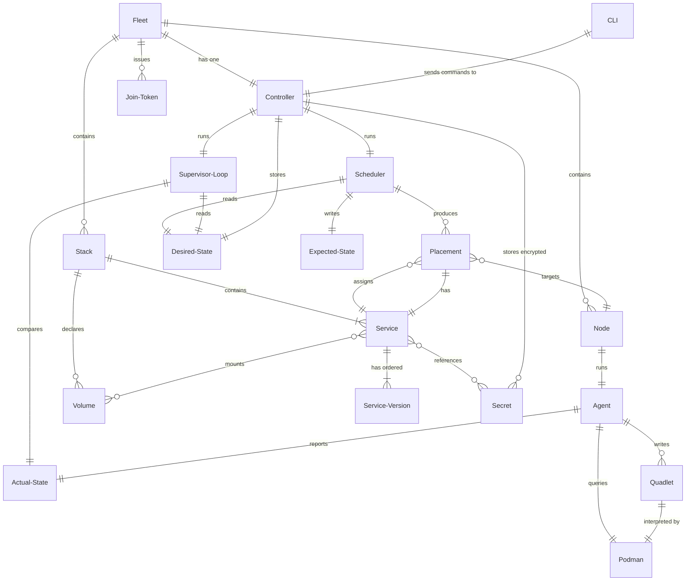

# Domain Model

Core domains and their relationships for the Podmander project.

## Glossary

### CLI (`podctl`)

The command-line interface through which operators interact with the fleet. All
commands (deploy, status, scale, rollback, secret management, etc.) are issued
through `podctl` and routed to the controller. The CLI is responsible for
command parsing, input validation, and output formatting.

### Fleet

The complete set of nodes managed by a single controller. A fleet has exactly
one controller and zero or more nodes. The fleet is the unit of administration:
one join token, one state database. Fleet-level settings are configured via
`podctl` commands.

### Controller

The single node that holds all cluster state (SQLite), makes scheduling
decisions, generates configuration, and coordinates agents. It is the only
writer to the state database. Operators interact with the fleet through the
controller via `podctl`.

### Node

A machine (physical or virtual) that runs an agent and hosts services. Each
node has a unique identity, labels for scheduling constraints, and optional
capabilities (e.g., ZFS support, rootful mode). The controller node may also
run services.

### Agent

The Podmander process running on each node. Agents are stateless beyond Quadlet
files on disk. They receive configuration from the controller, write it to the
local filesystem, manage systemd units, query Podman for container state, and
report status back over ZeroMQ. On restart, an agent rediscovers its workloads
from the filesystem and Podman API.

### Stack

A group of related services and volumes, initially defined in a TOML file
(analogous to a Docker Compose file). A stack always contains at least one
service. Multiple stacks can coexist in a fleet. Once deployed, the stack's
definition is stored in the controller's database; the TOML file is not
referenced again unless the operator re-deploys.

### Service

A workload belonging to exactly one stack. A service specifies an image,
placement rules, resource limits, health checks, and dependencies on other
services within the same stack. Services are the unit of scaling and rollback.
Examples: a replicated API, a singleton database, a daemonset-style exporter.

### Abstract Service Definition (ASD)

The structured representation of a service's configuration — image, environment
variables, ports, volumes, and other parameters — independent of any specific
execution format. The ASD is what the TOML parser produces and what the quadlet
generator consumes. It is the source of truth for what a service *is*; the
quadlet is a derived artifact rendered from it on demand.
_Avoid_: Service definition (ambiguous — could mean the ASD or the TOML input)

### Service Version

An immutable snapshot of a service's ASD at a point in time. Every `podctl
deploy` that changes a service creates a new version. The controller retains N
versions per service (default 10). Rollback creates a new version with content
from a previous version (like `git revert`), so version numbers always increase.
Expected State and Actual State reference a specific Service Version.

### Quadlet

A systemd unit file in Podman's Quadlet format (`.container`, `.volume`,
`.network`). Podmander generates Quadlets; systemd and Podman execute them.
Quadlets are the boundary between what Podmander controls and what the OS runs.

### Podman

The container runtime used to execute workloads. Agents interact with Podman
through its CLI and API to pull images, query container state, and manage
secrets. Podmander does not call Podman directly for container lifecycle —
instead it generates Quadlet files that systemd and Podman interpret. Podman
runs rootless by default under a dedicated unprivileged user.

### Placement Rule

A constraint in desired state that determines which nodes a service can run on.
Placement rules include `replicas` (N instances distributed across nodes),
`singleton` (exactly one), and `all` (one per node, daemonset-style). Rules
can reference node labels (e.g., "dedicated-vcpu"). Placement rules are part
of desired state, not expected state.
_Avoid_: Placement (ambiguous — could mean rule or decision)

### Join Token

A string that authorizes a new node to enroll in the fleet. Format:
`PTKN-<controller-z85-pubkey>-<hex-secret>`. The token embeds the controller's
CURVE public key (for encrypted transport) and a shared secret (for enrollment
authorization). Tokens can be rotated without affecting already-enrolled nodes.

### Scheduler

The controller component that evaluates placement rules, node labels, resource
availability, and constraints to produce expected state from desired state. It
runs as part of each reconciliation cycle and whenever the operator deploys or
scales a service. When conditions change (node labels, availability), the
scheduler re-runs and updates expected state.

### Secret

A sensitive value (password, API key, certificate) stored encrypted in the
controller's SQLite database using libsodium secretbox. Secrets have their own
lifecycle, independent of service versions. They are decrypted only for delivery
to agents over the ZeroMQ channel.

### Volume

Persistent storage attached to a service. Volumes have a driver: `directory`
(simple bind mount) or `zfs` (managed dataset with snapshots). ZFS volumes can
be snapshotted on deploy and rolled back alongside service versions.

### Desired State

What the operator wants: the latest Service Version for each service, plus
placement rules and other deployment intent. Stored in SQLite by the
controller. The supervisor loop compares desired state against actual state to
detect drift. For MVP, desired state is simply the latest Service Version per
service; placement rules are added when the scheduler is implemented.

### Expected State

The scheduler's concrete assignment of service versions to specific nodes,
derived from desired state and current node topology. Each entry specifies
one service version on one node (e.g., "api v3 on worker-01"). Expected state
is regenerable — when conditions change (node loses a label, node goes down),
the scheduler re-runs and produces new expected state. **For MVP, expected
state collapses into desired state because placement is trivial (deploy to
the connected agent). Expected State becomes a separate layer when the
scheduler is implemented.**

### Actual State

What is actually running on each node, as reported by agents. Each entry
specifies one service version on one node. For MVP, actual state tracks only
which version is deployed where; runtime status (RUNNING, STOPPED,
DEPLOY_FAILED, etc.) is added when agents report service-level status. The
supervisor loop compares actual state against desired state (MVP) or expected
state (full model) to detect drift.

### Supervisor Loop

The controller's continuous reconciliation cycle: receive agent status, update
actual state, compare against expected state, and act on divergences (alert or
auto-remediate). There is no separate "recovery mode" — startup, steady state,
and failure recovery all use the same loop.

### Infrastructure Component

A cluster-wide service managed by Podmander but not defined as a user service.
Infrastructure components include:

- **Caddy** — ingress proxy, configured via generated Caddyfile
- **CoreDNS** — service discovery, configured via generated zone files
- **Restic** — backups, configured via generated config and systemd timers

Infrastructure components have their own versioning (like services) and are
subject to drift detection. When the agent detects that a config file hash
doesn't match the expected value, the controller auto-repairs by redeploying
the expected config.

### Infra Version

An immutable snapshot of an infrastructure component's configuration at a point
in time. Like service versions, infra versions use monotonic numbering and
revert-style rollback. Each version stores the config content and its hash for
drift detection.
