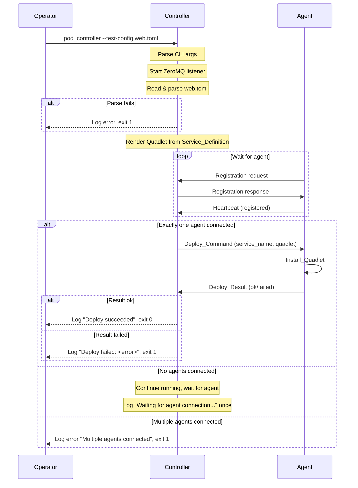

# Deploy Pipeline End-to-End: Controller `--test-config` Argument

For architectural decisions and rationale, see:
- [ADR-0004](../adr/0004-custom-toml-over-compose-yaml.md) — Custom TOML schema
- [ADR-0008](../adr/0008-one-operation-per-service.md) — One concurrent operation per service
- [ADR-0009](../adr/0009-zeromq-curve-for-control-plane.md) — ZeroMQ CURVE for control plane
- [ADR-0011](../adr/0011-podman-quadlet-for-containers.md) — Podman Quadlet for containers

Related issues: #58 (this feature), #9 (TOML parsing, merged), #11 (Quadlet generation, PR #57).

## Goal

Wire together the existing TOML config parser, Quadlet generator, and ZeroMQ
deploy protocol so that a single `pod_controller --test-config <path>` invocation
can deploy a service to a connected agent and report the result. This validates
the full pipeline without requiring the CLI tool (`podctl`).

## Scope

### In scope

- `--test-config <path>` CLI argument on `pod_controller`
- Service name extraction from TOML `[service.<name>]` section header
- Parse → render → send → receive pipeline
- Agent selection: exactly-one-connected-agent rule
- Error reporting for all failure modes
- Unit and integration tests for the pipeline

### Deferred

- `podctl deploy` CLI subcommand (needs #7 CLI framework)
- Multi-node agent selection / scheduling
- Version tracking in SQLite (#10 supervisor loop)
- Rollback (needs version tracking)
- Service scaling (replicas > 1)
- Multiple services in a single TOML file
- Supervisor loop integration (continuous reconciliation)

## Data Flow



## Detailed Design

### 1. CLI argument

Add `--test-config <path>` to `pod_controller`. The existing `Podmander.CLI.Get`
parser already supports `--key=value` and `--key value` syntax.

```
pod_controller [--bind=<addr>] [--log-level=<level>] [--test-config=<path>]
```

When `--test-config` is provided:

1. The controller reads and parses the TOML file **before** entering the run
   loop. Parse failure is a fatal error (log + exit 1).
2. The controller starts normally (bind socket, generate join token).
3. After an agent registers and sends its first heartbeat, the controller
   checks the agent count and proceeds with deployment (see §3).

When `--test-config` is **not** provided, the controller behaves exactly as it
does today — no change to the existing code path.

### 2. Service name extraction

The `Service_Definition` type currently has no `Name` field. The TOML parser
iterates over `[service.<name>]` entries and uses the first one, but discards
the key (the service name).

**Change**: Add a `Name` field to `Service_Definition`:

```ada
type Service_Definition is record
   Name          : Unbounded_String;       --  NEW: from [service.<name>]
   Image         : Unbounded_String;
   Env           : Env_Array (1 .. MAX_ENV_ENTRIES);
   Env_Count     : Natural := 0;
   Ports         : Port_Array (1 .. MAX_PORTS_ENTRIES);
   Ports_Count   : Natural := 0;
   Volumes       : Volume_Array (1 .. MAX_VOLUMES_ENTRIES);
   Volumes_Count : Natural := 0;
   Description   : Unbounded_String;
   WantedBy      : Unbounded_String;
end record;
```

The parser sets `Config.Name` to the TOML table key (`Entries(Entries'First).Key`).

This is a **breaking change** to `Service_Definition` — every aggregate
construction of the record must include the new `Name` field. Affected sites:
test fixtures, generator tests, and any other code that builds
`Service_Definition` values directly. The change is mechanical (add
`Name => To_Unbounded_String ("...")`) but touches multiple files.

The `Name` field is required for:

- `Deploy_Command.Service_Name` (protocol message)
- Quadlet file naming (`.container` filename)
- Logging and error messages

### 3. Agent selection and deploy trigger

The controller's run loop currently processes messages in a tight
`poll → handle → check_timeouts` cycle. The `--test-config` deploy must
integrate into this loop.

**Design**: Add a `Pending_Deploy` field to `Controller_Instance`:

```ada
type Pending_Deploy is record
   Service_Name : Unbounded_String;
   Quadlet      : Unbounded_String;
   Deployed     : Boolean := False;
end record;

type Controller_Instance is tagged limited record
   Config          : Controller_Config;
   DB              : Database.DB_Handle;
   Certificate     : CZMQ.Certificates.Certificate;
   Socket          : CZMQ.Sockets.Socket;
   Agents          : Agent_Maps.Map;
   Running         : Boolean := False;
   Test_Deploy     : Pending_Deploy;   --  NEW
end record;
```

When `--test-config` is provided:

1. Parse the TOML file and render the Quadlet **before** entering the run loop.
2. Store the result in `Test_Deploy`.
3. In the run loop, after each `Handle_Message` call, check:
   - `Test_Deploy.Deployed` is `False`
   - `Agents.Length = 1`
4. When both conditions are true, send the `Deploy_Command` to the single
   connected agent and set `Test_Deploy.Deployed := True`.

**Agent count rules** (from the issue):

| Connected agents | Action |
|------------------|--------|
| 0 | Continue the run loop. The controller is waiting for an agent to connect. Log "Waiting for agent connection to deploy <service_name>" at Info level, once (not on every loop iteration). |
| 1 | Send `Deploy_Command` to that agent. Set `Deployed := True`. |
| >1 | Log error "Multiple agents connected; cannot select target for --test-config. Use podctl deploy for multi-node deploys." and set `Deployed := True` (to prevent repeated error logging). |

**Why exit after deploy?** The `--test-config` flag is a prototype mechanism
for validating the end-to-end pipeline, not a production workflow. Exiting
cleanly after the deploy result arrives gives the operator a clear, synchronous
outcome: the process returns 0 on success, non-zero on failure. The production
deploy path (`podctl deploy`) will use the long-running daemon with the
supervisor loop.

### 4. Sending Deploy_Command from the controller

The controller already has a `Send_Status_Query` procedure that demonstrates
the pattern for sending a message to a specific agent via the ROUTER socket.
Follow the same pattern for `Send_Deploy_Command`:

```ada
procedure Send_Deploy_Command
  (H            : in out Controller_Handler;
   Service_Name : String;
   Quadlet      : String);
```

Implementation:

1. Construct a `Deploy_Command` message with `Service_Name` and `Quadlet`.
2. Create a `CZMQ.Messages.Message`, add the agent's `Node_Id` as the identity
   frame, encode the `Deploy_Command`, and send via `H.Ctrl.Socket`.

This mirrors `Send_Status_Query` exactly, differing only in message type and
payload fields.

### 5. Handling Deploy_Result

The controller already handles `Deploy_Result` messages in
`Handle_Deploy_Result` — it logs success or failure. No changes needed to the
result handling logic.

For the `--test-config` flow, the result is purely informational (logged). The
controller does not track deployment state in SQLite (that's deferred to the
supervisor loop, #10).

### 6. Error handling

| Error | Behavior |
|-------|----------|
| `--test-config` file not found | Log error with file path, exit 1 |
| TOML parse error | Log error with parser message, exit 1 |
| Validation error (empty image, invalid port) | Log error with validation message, exit 1 |
| Quadlet render error | Log error, exit 1 (should not happen if validation passed) |
| No agents connected after timeout | Log "Waiting for agent connection..." at Info level. Controller continues running until an agent connects or the operator interrupts. |
| Multiple agents connected | Log error, exit 1 |
| Deploy_Result with Ok | Log "Deploy succeeded for <service_name>", exit 0 |
| Deploy_Result with Failed/Unavailable/Internal | Log warning with service name and error message, exit 1 |
| Deploy_Result with Invalid_Argument | Log warning, exit 1 |

The controller exits after receiving the `Deploy_Result` (or after a fatal
pre-deploy error). This is intentional: `--test-config` is a one-shot
validation mechanism, not a production workflow.

### 7. Startup sequence

The `pod_controller` main procedure changes from:

```ada
declare
   Ctrl : Controller_Instance := Make_Listening_Controller (Config);
begin
   Ctrl.Generate_Join_Token (Token);
   Ctrl.Run;
end;
```

To:

```ada
declare
   Ctrl : Controller_Instance := Make_Listening_Controller (Config);
begin
   Ctrl.Generate_Join_Token (Token);

   --  If --test-config was provided, parse and validate the config,
   --  render the Quadlet, and store it for deployment.
   declare
      Config_Path : constant String := CLI.Get ("test-config", "");
   begin
      if Config_Path'Length > 0 then
         declare
            Result : constant Config.Parser.Parse_Result :=
              Config.Parser.Parse (Config_Path);
         begin
            if Result.Success then
               declare
                  Quadlet_Content : constant String :=
                    Generators.Quadlet.Render (Result.Config);
               begin
                  Ctrl.Test_Deploy :=
                    (Service_Name => Result.Config.Name,
                     Quadlet      => To_Unbounded_String (Quadlet_Content),
                     Deployed     => False);
                  Logging.Info
                    ("controller",
                     "Will deploy " & To_String (Result.Config.Name)
                     & " from " & Config_Path);
               end;
            else
               Logging.Critical
                 ("controller",
                  "Failed to parse " & Config_Path & ": "
                  & To_String (Result.Message));
               --  Exit with error code
               return;
            end if;
         end;
      end if;
   end;

   Ctrl.Run;
end;
```

### 8. Run loop integration

In the `Run` procedure, after `Handle_Message` and `Check_Timeouts`, add a
check for the pending deploy:

```ada
--  Check for pending test-config deploy
if not Self.Test_Deploy.Deployed
   and then Self.Test_Deploy.Service_Name'Length > 0
then
   if Self.Agents.Length = 1 then
      declare
         Cursor : constant Agent_Maps.Cursor := Self.Agents.First;
         Info   : constant Agent_Info := Self.Agents (Cursor);
      begin
         Send_Deploy_Command
           (Self,
            Service_Name => To_String (Self.Test_Deploy.Service_Name),
            Quadlet      => To_String (Self.Test_Deploy.Quadlet));
         Self.Test_Deploy.Deployed := True;
      end;
   elsif Self.Agents.Length > 1 then
      Logging.Error
        ("controller",
         "Multiple agents connected; cannot select target for --test-config."
         & " Use podctl deploy for multi-node deploys.");
      Self.Stop;
      return;
   end if;
end if;
```

When `Deploy_Result` is received in `Handle_Deploy_Result` and
`Test_Deploy.Deployed` is `True`, the controller logs the result and calls
`Self.Stop` to exit the run loop. Exit code 0 for `Ok`, exit code 1 for
any failure result code.

The `Handle_Deploy_Result` procedure needs access to the controller instance
to check `Test_Deploy.Deployed` and call `Stop`. It already has `H.Ctrl`
(access to `Controller_Instance`), so this is straightforward.

## Test Plan

### Unit tests

| Test | What it verifies |
|------|-----------------|
| `Service_Definition` with `Name` field | Existing tests compile with new `Name` field |
| `Parse` extracts service name | `[service.web]` → `Config.Name = "web"` |
| `Parse` with missing service name | Error if TOML has no `[service.*]` section |
| `--test-config` with valid file | Controller stores pending deploy with correct service name and quadlet content |
| `--test-config` with invalid file | Controller logs error and exits |
| `--test-config` with nonexistent file | Controller logs error and exits |
| `Send_Deploy_Command` | Message encodes correctly with service name and quadlet content |
| Agent count = 0 | Deploy not attempted, no error logged on every iteration |
| Agent count = 1 | Deploy command sent to the single agent |
| Agent count > 1 | Error logged, deploy marked as attempted |

### Integration test

End-to-end test that:

1. Starts a controller with `--test-config` pointing to a valid TOML file
2. Connects a mock agent (using existing test infrastructure)
3. Verifies the controller sends a `Deploy_Command` with the correct service
   name and quadlet content
4. Mock agent processes the deploy (or simulates success)
5. Verifies the controller logs the `Deploy_Result`

This test uses the existing `Spy_Handler` and offline controller patterns from
`podmander-controller_tests.adb`.

## File Changes Summary

| File | Change |
|------|--------|
| `src/config/podmander-config.ads` | Add `Name` field to `Service_Definition` |
| `src/config/podmander-config-parser.adb` | Set `Config.Name` from TOML table key |
| `src/controller/podmander-controller.ads` | Add `Pending_Deploy` type and `Test_Deploy` field to `Controller_Instance`; add `Send_Deploy_Command` procedure |
| `src/controller/podmander-controller.adb` | Implement `Send_Deploy_Command`; add deploy trigger in `Run` loop |
| `src/bin/pod_controller.adb` | Add `--test-config` argument handling; parse and store pending deploy before `Run` |
| `src/generators/podmander-generators-quadlet.adb` | No change (already works with `Service_Definition`) |
| `tests/podmander-config_tests.adb` | Add `Name` field to test constructions; add test for name extraction |
| `tests/podmander-generators-quadlet_tests.adb` | Add `Name` field to test constructions |
| `tests/podmander-controller_tests.adb` | Add tests for `--test-config` flow, agent count logic, `Send_Deploy_Command` |

## Open Items

None. All questions from the issue description are resolved:

- **Service name source**: Extracted from TOML `[service.<name>]` section header, stored in `Service_Definition.Name`.
- **Agent selection**: Exactly-one rule. Zero agents = wait. Multiple = error.
- **Post-deploy behavior**: Controller continues running; result is logged.
- **Protocol changes**: None needed. `Deploy_Command` already carries `Service_Name` and `Quadlet`.